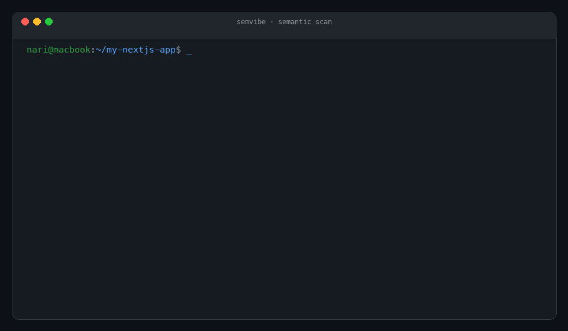

<div align="center">

<picture>
  <source media="(prefers-color-scheme: dark)" srcset="docs/assets/logo-dark.svg">
  <source media="(prefers-color-scheme: light)" srcset="docs/assets/logo-light.svg">
  
</picture>

### Catch architectural drift in AI-generated TypeScript codebases

[](https://github.com/Nari-Ab/semvibe/actions)
[-1f9d55)](#privacy--security)
[](https://www.npmjs.com/package/semvibe)
[](https://www.npmjs.com/package/semvibe)
[](LICENSE)

</div>

When coding with Cursor, Claude Code, or Codex, projects gradually accumulate **architectural drift**: error contracts get mixed up (`throw` vs `{ error: ... }`), agents pull in redundant libraries (`axios` alongside native `fetch`), and conventions erode over time.

Semvibe analyzes your TypeScript AST locally, infers your project's dominant conventions, and flags files that deviate from them.

```bash
npx semvibe scan .    # scan project for architectural drift; 100% offline
npx semvibe learn .   # inspect discovered dominant conventions
```

What a finding looks like:

```text
semvibe scan — architectural drift in TypeScript codebases

❌ 2 architectural deviation(s) found in 428 scanned files

VIOLATIONS FOUND (2)

  ● lib/api/domains/utils.ts:6 in validateDomain()
      Observed: error-object | Expected: throw
      Reason:   95%+ of API routes throw AppError. Returning error-object violates contract.
      Fix:      throw new AppError('Invalid domain', 422)

  ● auth/signup/utils/prefillAvatar.ts:1
      Observed: node-fetch | Expected: native-fetch
      Reason:   Project globally uses native global fetch. Redundant library imported.
      Fix:      Remove node-fetch and use global fetch()
```

<div align="center">
  
</div>

- **Infers conventions.** Semvibe learns what's standard from your own code patterns instead of forcing rigid, pre-configured rules.
- **Zero telemetry.** 100% offline and local. Zero network calls, zero tracking. Your code never leaves your machine. MIT.
- **Guards what's next.** Exports discovered conventions into `AGENTS.md` and `CLAUDE.md` to keep future AI coding agent sessions aligned with your architecture.

## Commands

- `npx semvibe scan [dir]` — Scan codebase for semantic outliers and contract deviations.
- `npx semvibe learn [dir]` — Discover and inspect dominant statistical invariants.
- `npx semvibe export-rules` — Export conventions into `AGENTS.md` and `CLAUDE.md` for AI agent guardrails.

## Privacy & Security

Semvibe is built for security-conscious teams:
- Runs strictly on your local machine using static TypeScript AST analysis.
- Zero network requests. No external APIs, no analytics, no third-party telemetry.

## License

[MIT](LICENSE)
